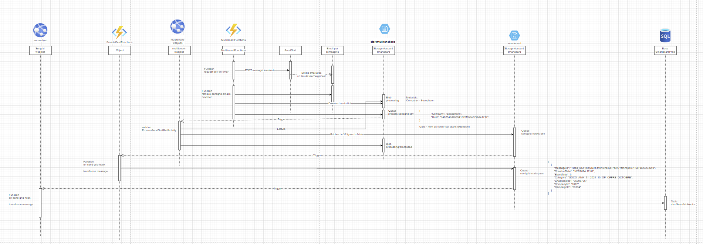
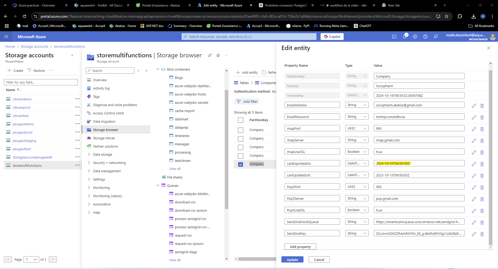
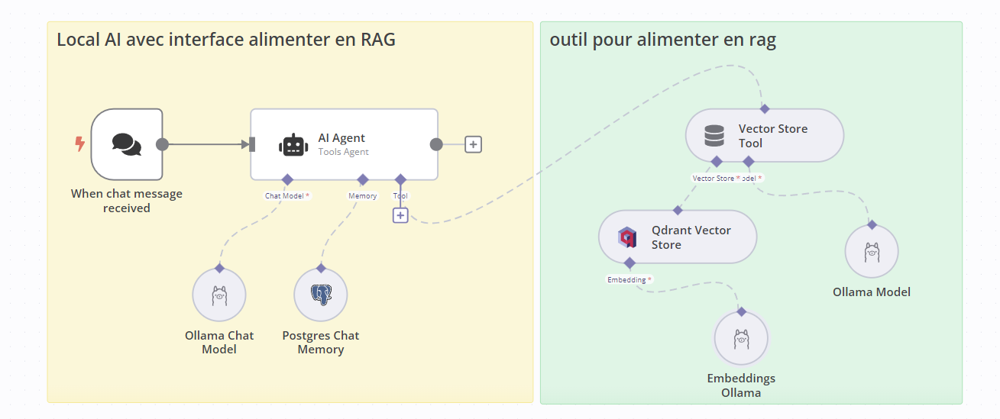
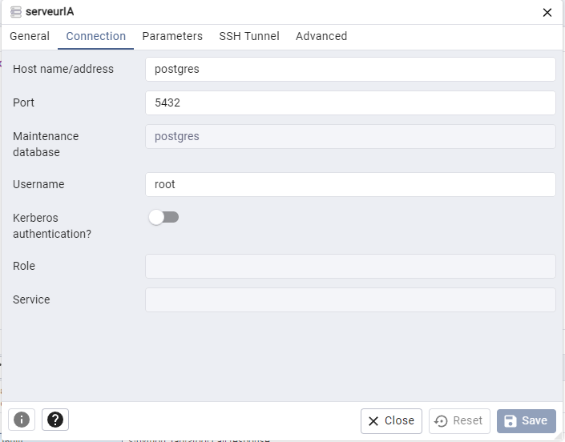
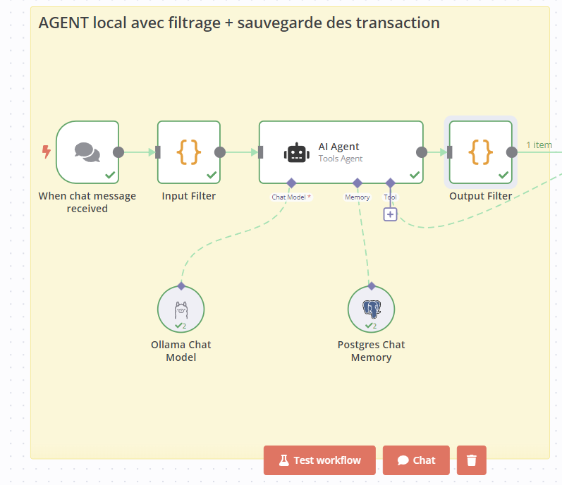
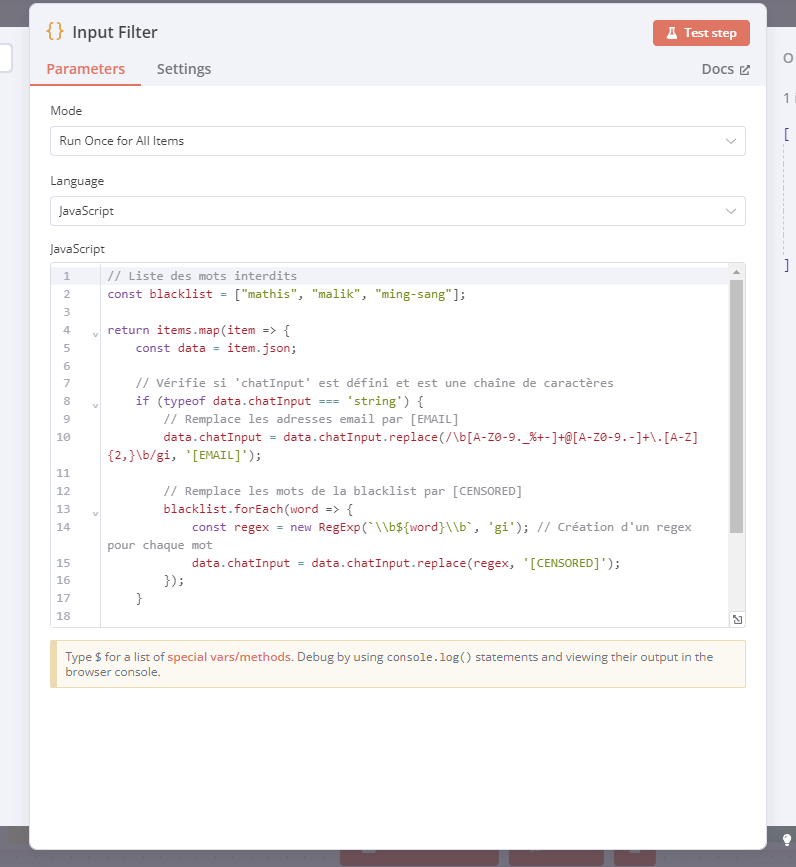
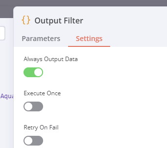

# ToolKit Aquawebit


## Table des matières

1. [Introduction](#introduction)
2. [Requette SQL (smartecard)](#requette-sql)
   1. [Requette pour voir les achats fait par les clients](#requette-pour-voir-les-achats-fait-par-les-clients)
   2. [Voir ou est installer une carte](#voir-ou-est-installer-une-carte)
   3. [correction de transaction](#correction-de-transaction)
   4. [ajouter pdf aide au groupement](#ajouter-pdf-aide-au-groupement)
   5. [Count coupons installer/utiliser](#count-coupons-installerutiliser)
   6. [Calcule des stats des campagnes Trigger](#calcule-des-stats-des-campagnes-trigger)
   7. [procedure stocker](#procedure-stocker)
3. [Wordpress](#wordpress)
   1. [certificat](#certificat-wordpress)
   2. [Extention](#extention)
   3. [](#)
   4. [](#)
4. [smartEcard/mosaicMaker](#smartecardmosaicmaker)
   1. [certificat](#certificat)
   2. [sandgrid](#sandgrid)
   3. [](#)
5. [AI - Chatbot](#ai)
   1. [contexte](#contexte)
   2. [fonctionnement](#fonctionnement)
   3. [préparatif du workflow](#préparatif-du-workflow)
6. [Liens utile](#liens-utile)
   1. [aquawebit](#aquawebit)
   2. [MosaicMaker](#mosaicmaker)
   3. [Aquaprawna🦐](#aquaprawna🦐)
7. [Support](#support)


## Requette SQL

### Requette pour voir les achats fait par les clients

(pour un type de produit)

> Changer id, template, date et produit

```SQL
select c.identifier from dbo.cards c with (nolock)

	inner join dbo.clients cl with (nolock) on cl.id=c.clientid

where

	c.companyid=XXXX

	and c.templateid=XXXX

	and c.lockdate is null

	and cl.lockdate is null

	and cl.mobile is not null

	and cl.unsubscribesmsdate is null

and exists (select 1 from dbo.transactions t  with (nolock)

				inner join dbo.transactionproducts tp with (nolock) on tp.transactionid=t.id

				inner join dbo.products p with (nolock) on p.id=tp.productid

			where

				t.companyid=XXXX

				and t.cardid=c.id

				and t.creationdate >='2023-09-30 00:00:09.387'

				and p.brand in ('CAUDALIE', 'ACM LABORATOIRE DERMATOLOGIQUE', 'LA ROCHE POSAY', 'SVR', 'DUCRAY')

			)
```


### Voir ou est installer une carte

Voir sur quel device est installer une carte

> Changer companyID + identifier

```SQL
select * from dbo.Cards with(nolock) where CompanyId=XXXX and Identifier='00000000000XX'

select * from dbo.DevicesCards with(nolock) where CardId=XXXXXXXX

select * from dbo.Devices with(nolock) where id=XXXXXXX
```


### correction de transaction

> verifier la transaction faite

```SQL
select * from dbo.cards with(nolock) where Identifier='1000002010457 ' and CompanyId=1072
1075 = pharma10 dans cette exemple
select * from dbo.Transactions with(nolock) where cardid=18485168 order by CreationDate desc
```

> puis corriger la

```SQL
select * from dbo.Transactions with(nolock) where id=11989820 order by CreationDate desc


begin tran
	update dbo.Transactions set LockDate=GETDATE(), LockReason='support transaction erroner', LastUpdate=GETDATE() where id=11989820
	select * from dbo.Transactions with(nolock) where id=11989820 order by CreationDate desc
rollback tran
```


### ajouter pdf aide au groupement

> selectionner le groupement a choisir

```SQL

begin tran

	insert into dbo.helps(
		Identifier,
		name,
		description,
		Url,
		Category,
		UserId,
		CompanyId,
		CreationDate
		)
	VALUES(
		NEWID(),
		--nom du doc
		'Installation dans Google Wallet',
		--description du doc
		'Aide à l''installation de la carte de fidélité dans Google Wallet'
		,--chemain de la doc dans le blob a mêttre ici
		'https://smartecardstaging.blob.core.windows.net/helpfiles/8FF95FB0-77B1-40B7-81AD-3BBE487891F2/Aide_Installation_Google_Wallet-PassFidelitebyPharma10.pdf'
		,'Portail'
		,XXXXX --userId
		,XXXX --compagnyId
		,GETDATE())

rollback tran
```


### Count coupons installer/utiliser

> calculer le nombre de carte installer + carte utiliser

```SQL
select COUNT(1) from dbo.Cards with(nolock) where CompanyId=1024 and TemplateId=1244 and InstallDate is not null -- 0


--petit stock
select COUNT(1) from dbo.Cards with(nolock) where CompanyId=1024 and TemplateId=1244 and BurnedDate is not null -- 417

--grand stock
select count(1) from dbo.TransactionCoupons tc with(nolock)
	inner join dbo.Cards ca with(nolock) ON tc.CouponId = ca.Id
where ca.CompanyId= 1024 and
	ca.TemplateId=1244

```


### Calcule des stats des campagnes Trigger

chemin pour prendre les logs (pour comparer)

```
Storage account
	->SmartEcard Peugot
		->storemultifunctions
			->Storage browser
				->processing
					->processed
						->choisir le fichier du groupement a la bonne date (sandgrind met 24h a traiter donc prendre j+1)
					-> allez sur exel et importer le fichier .CSV
```

> Pour comparer avec le fichier (clientCards non fiable a 100%)

```SQL
select * from ClientCards where CompanyId=1072  and CardIdentifier='1000001906515'

--D1-1  -> encien
select DISTINCT
	ca.CardIdentifier D1_1,
	ca.Id cardId ,
	Lc.CampaignId,
	Lc.NbrOccContact,
	Lc.LastUpdate,
	ca.ClientUnsubscribeEmailDate emailUnsub
from ClientCards ca with(nolock)
	inner join campaigns.LogCampaigns Lc with(nolock) ON lc.CardId= ca.Id
where
	lc.CampaignId=32877 and
	ca.CompanyId=1072 and
	lc.LastUpdate ='2024-07-31 08:06:15.073'
Order by lc.LastUpdate asc
```

> pour remplir le fichier

```SQL

-- voir le nombre de compte plus recontacter (en théorie) après la date selectionner
select
	ca.Identifier ,
	ca.Id cardId,
	Lc.CampaignId,
	Lc.NbrOccContact,
	Lc.LastUpdate,
	cl.UnsubscribeEmailDate
from campaigns.LogCampaigns Lc with(nolock)
	inner join dbo.Cards ca with(nolock) on ca.Id = lc.CardId
	inner join dbo.Clients cl with(nolock) on cl.id = ca.ClientId
where
	lc.CampaignId=32877 and
	cl.CompanyId=1072 and
	lc.LastUpdate ='2024-07-31 08:06:15.073'
Order by lc.LastUpdate asc


--sans les statuts 3
select
	ca.Identifier ,
	ca.Id cardId,
	Lc.CampaignId,
	Lc.NbrOccContact,
	Lc.LastUpdate,
	cl.UnsubscribeEmailDate
from campaigns.LogCampaigns Lc with(nolock)
	inner join dbo.Cards ca with(nolock) on ca.Id = lc.CardId
	inner join dbo.Clients cl with(nolock) on cl.id = ca.ClientId
where
	lc.CampaignId=32877 and
	cl.CompanyId=1072 and
	lc.LastUpdate ='2024-07-31 08:06:15.073' and
	Lc.NbrOccContact != 3
Order by lc.LastUpdate asc

--D1-1
select
	ca.Identifier ,
	ca.Id cardId,
	Lc.CampaignId,
	Lc.NbrOccContact,
	Lc.LastUpdate,
	cl.UnsubscribeEmailDate
from campaigns.LogCampaigns Lc with(nolock)
	inner join dbo.Cards ca with(nolock) on ca.Id = lc.CardId
	inner join dbo.Clients cl with(nolock) on cl.id = ca.ClientId
where
	lc.CampaignId=32877 and
	cl.CompanyId=1072 and
	lc.LastUpdate ='2024-07-31 08:06:15.073' and
	cl.UnsubscribeEmailDate is not null and
	cl.Email is not null
Order by lc.LastUpdate asc


--D1-1-1 -> désabonner avant la requette
select
	ca.Identifier ,
	ca.Id cardId,
	Lc.CampaignId,
	Lc.NbrOccContact,
	Lc.LastUpdate,
	cl.UnsubscribeEmailDate
from campaigns.LogCampaigns Lc with(nolock)
	inner join dbo.Cards ca with(nolock) on ca.Id = lc.CardId
	inner join dbo.Clients cl with(nolock) on cl.id = ca.ClientId
where
	lc.CampaignId=32877 and
	cl.CompanyId=1072 and
	lc.LastUpdate ='2024-07-31 08:06:15.073' and
	cl.Email is not null and
	cl.UnsubscribeEmailDate < '2024-07-31 08:06:15.07'
Order by lc.LastUpdate asc


--D1-1-2 -> désabonner après la requette
select
	ca.Identifier ,
	ca.Id cardId,
	Lc.CampaignId,
	Lc.NbrOccContact,
	Lc.LastUpdate,
	cl.UnsubscribeEmailDate
from campaigns.LogCampaigns Lc with(nolock)
	inner join dbo.Cards ca with(nolock) on ca.Id = lc.CardId
	inner join dbo.Clients cl with(nolock) on cl.id = ca.ClientId
where
	lc.CampaignId=32877 and
	cl.CompanyId=1072 and
	lc.LastUpdate ='2024-07-31 08:06:15.073' and
	cl.Email is not null and
	cl.UnsubscribeEmailDate < '2024-07-31 08:06:15.07'
Order by lc.LastUpdate asc


--D1-2
select
	ca.Identifier ,
	ca.Id cardId,
	Lc.CampaignId,
	Lc.NbrOccContact,
	Lc.LastUpdate,
	cl.UnsubscribeEmailDate
from campaigns.LogCampaigns Lc with(nolock)
	inner join dbo.Cards ca with(nolock) on ca.Id = lc.CardId
	inner join dbo.Clients cl with(nolock) on cl.id = ca.ClientId
where
	lc.CampaignId=32877 and
	cl.CompanyId=1072 and
	lc.LastUpdate ='2024-07-31 08:06:15.073' and
	cl.UnsubscribeEmailDate is not null and
	cl.Email is null
Order by lc.LastUpdate asc


--D2-1
select
	ca.Identifier ,
	ca.Id cardId,
	Lc.CampaignId,
	Lc.NbrOccContact,
	Lc.LastUpdate,
	cl.UnsubscribeEmailDate
from campaigns.LogCampaigns Lc with(nolock)
	inner join dbo.Cards ca with(nolock) on ca.Id = lc.CardId
	inner join dbo.Clients cl with(nolock) on cl.id = ca.ClientId
where
	lc.CampaignId=32877 and
	cl.CompanyId=1072 and
	lc.LastUpdate ='2024-07-31 08:06:15.073' and
	cl.UnsubscribeEmailDate is null and
	cl.Email is not null
Order by lc.LastUpdate asc

-- != statut 3
select
	ca.Identifier ,
	ca.Id cardId,
	Lc.CampaignId,
	Lc.NbrOccContact,
	Lc.LastUpdate,
	cl.UnsubscribeEmailDate
from campaigns.LogCampaigns Lc with(nolock)
	inner join dbo.Cards ca with(nolock) on ca.Id = lc.CardId
	inner join dbo.Clients cl with(nolock) on cl.id = ca.ClientId
where
	lc.CampaignId=32877 and
	cl.CompanyId=1072 and
	lc.LastUpdate ='2024-07-31 08:06:15.073' and
	cl.UnsubscribeEmailDate is null and
	lc.NbrOccContact != 3 and
	cl.Email is not null
Order by lc.LastUpdate asc


--D2-2
select
	ca.Identifier ,
	ca.Id cardId,
	Lc.CampaignId,
	Lc.NbrOccContact,
	Lc.LastUpdate,
	cl.UnsubscribeEmailDate
from campaigns.LogCampaigns Lc with(nolock)
	inner join dbo.Cards ca with(nolock) on ca.Id = lc.CardId
	inner join dbo.Clients cl with(nolock) on cl.id = ca.ClientId
where
	lc.CampaignId=32877 and
	cl.CompanyId=1072 and
	lc.LastUpdate ='2024-07-31 08:06:15.073' and
	cl.UnsubscribeEmailDate is null and
	cl.Email is null
Order by lc.LastUpdate asc

```

> si ils y a plusieurs date du a des relances:

```SQL
-- plusieurs date :
select
	ca.Identifier ,
	ca.Id cardId,
	Lc.CampaignId,
	Lc.NbrOccContact,
	Lc.LastUpdate,
	cl.UnsubscribeEmailDate
from campaigns.LogCampaigns Lc with(nolock)
	inner join dbo.Cards ca with(nolock) on ca.Id = lc.CardId
	inner join dbo.Clients cl with(nolock) on cl.id = ca.ClientId
where
	lc.CampaignId=32877 and
	cl.CompanyId=1072 and
	(
		lc.LastUpdate ='2024-08-31 08:03:05.987' or
		lc.LastUpdate ='2024-09-01 08:04:06.083' or
		lc.LastUpdate ='2024-09-02 08:19:41.037' or
		lc.LastUpdate ='2024-09-03 08:04:21.070' or
		lc.LastUpdate ='2024-09-04 08:03:15.023' or
		lc.LastUpdate ='2024-09-05 08:03:44.193' or
		lc.LastUpdate ='2024-09-06 08:03:14.100' or
		lc.LastUpdate ='2024-09-07 08:03:16.500'
	)
Order by lc.LastUpdate asc
```

### procedure stocker

```SQL
	CREATE PROCEDURE MigrationStoreCIP
(
        @CIP NVARCHAR(100) = NULL,
        @NewCIP NVARCHAR(100) = NULL,
        @compagnyID INT = NULL
)
AS 
BEGIN

	DECLARE @storeID INT = NULL
	SET @storeID = (SELECT id FROM dbo.Stores WHERE companyId=@compagnyID and Identifier=@CIP);
	DECLARE @Doublon INT = NULL
	SET @Doublon = (select count(1) from dbo.stores where companyId=@compagnyID and Identifier=@CIP);

	IF @Doublon = 1
		BEGIN
		Update dbo.stores 
		set Identifier = @NewCIP, 
			Name = REPLACE(Name, @CIP, @NewCIP),
			LastUpdate = getdate()
		Where id=@storeID;

		update dbo.AspNetUsers
		set 
			Identifier =REPLACE(Identifier, @CIP, @NewCIP),
			UserName =REPLACE(UserName, @CIP, @NewCIP),
 			LastName =REPLACE(LastName, @CIP, @NewCIP),
			Email =REPLACE(Email, @CIP, @NewCIP)
		where 
			storeID=@storeID
		END;
	ELSE
		BEGIN
			PRINT 'magasin en double ou introuvable';
		END
END;
```

> executer le script :

```SQL
 EXEC MigrationStoreCIP param="XXXX", param2=1234 ... ;
```

> voir les procstoc

```SQL
SELECT name, create_date, modify_date, type
FROM sys.objects with(nolock)
WHERE type = 'P' 
ORDER BY name;
```

> voir ce qu'il y as dedans

```SQL
sp_helptext 'MigrationStoreCIP';
```

## Wordpress

### certificat wordpress

> pour avoir le HTTPS :)

[tuto a suivre](https://wpformation.com/wordpress-http-https/ "Titre de la video")

## smartEcard/mosaicMaker

### Certificat

### Extention

####  Duplicator (Pro) 

extention pour dupliquer les sites wp

####  toolset 

####  Wordfence Security 

Extension de sécurité (version premium)

####  Spectra 

Qui va de paire avec spectra One

####  Contact Form 7 + Contact Form CFDB7 

Pour crée des formulaires

---

### sandgrid

#### fonctionnement



si vous faite un changement dans le code (sur l'unicité) :

- /!\ changer la contrainte d'unicité sur les hash
- regénérer les fichiers
- => avoir fichier dans le blob processing avec un nouveau Uuid
- => allez dans la Queue et mêtre le json
- => changer la date dans la table compagnie
- => verifier que tout ce passse bien  👌
- => verifier que dans sandgrid-pass-stats que c'est bon



crée des uid : [Free Online GUID Generator](https://guidgenerator.com/)

renommer le fichier selon le Uuid

message a mêtre dans la Queue:

```JSON
{
                "Company": "Socopharm",
                "Uuid": "34b2546dabb541c78fbb0e572bae1717",
}
```

> metadata : company  Uuid = nom du fichier en CSV

---

## AI


### Contexte

Dans notre cas nous avont besoin d'une IA , qui devra répondre a nos critère d'exigence tout en respectant notre condition de confidentialité.

Pour cela nous somme partie sur une IA heberger localement et si possible en RAG.

la solution trouver pour l'hébergement est Ollama qui utilisera un model qui évolura avec le temps : llama 3.1

[vidéo explicative](https://www.youtube.com/watch?v=V_0dNE-H2gw)

[le git](https://github.com/coleam00/ai-agents-masterclass/tree/main/local-ai-packaged)


### fonctionnement



### préparatif du workflow

 Clonage et Installation du docker 

> clonage + installation pour GPU nvidia

```sh
	git clone https://github.com/n8n-io/self-hosted-ai-starter-kit.git
	cd self-hosted-ai-starter-kit
	docker compose --profile gpu-nvidia up
```

> mise a niveau

```sh
	docker compose --profile gpu-nvidia pull
	docker compose create && docker compose --profile gpu-nvidia up
```

---

 Commande docker utile 

> voir le paramétrage du container

```sh
	docker inspect self-hosted-ai-starter-kit-postgres-1
```

---

 Ollama 

Config

- url : http://ollama:11434

---

 postgres 

> se connecter en root en terminal si pgadmin n'est pas installer

```sh
	docker exec -it self-hosted-ai-starter-kit-postgres-1 psql -U root -d n8n
```
```SQL
	\du --voir les users
	\dt -- voir les tables
	\l --voir les bases de données
	\d test -- voir les champs de la table (test en locurence)
	\q --quitter
```

> (config de base)

- Host : postgres 
- DataBase : n8n
- User : root
- Password : password
- Port : 5432

---

 Qdrant 

=> [dashboard](http://qdrant:6333/)

> Config base

- Url : http://qdrant:6333/


---

 pgadmin 


identifiant :
-	malik.desenfant@aquawebit.com
-	admin

connection au serveur :


[doc AI Agent](https://docs.n8n.io/integrations/builtin/cluster-nodes/root-nodes/n8n-nodes-langchain.agent/?utm_source=n8n_app&utm_medium=node_settings_modal-credential_link&utm_campaign=%40n8n%2Fn8n-nodes-langchain.agent)


```SQL
	SELECT id, session_id,message, message::json->>'content' AS content, createdate 
	FROM n8n_chat_histories_2
	Order by id desc;
```


__________________
#### Etape 2

Laisser n8n crée la tables en métant un nom de table non crée puis insérer les camps supplémentaire si besoin.

crée un fonction de filtrage en Input : 
>exemple ci de dessou pour les mots + email
```JS
// Liste des mots interdits
const blacklist = ["mathis", "malik", "ming-sang"];

return items.map(item => {
    const data = item.json;

    // Vérifie si 'chatInput' est défini et est une chaîne de caractères
    if (typeof data.chatInput === 'string') {
        // Remplace les adresses email par [EMAIL]
        data.chatInput = data.chatInput.replace(/\b[A-Z0-9._%+-]+@[A-Z0-9.-]+\.[A-Z]{2,}\b/gi, '[EMAIL]');

        // Remplace les mots de la blacklist par [CENSORED]
        blacklist.forEach(word => {
            const regex = new RegExp(`\\b${word}\\b`, 'gi'); // Création d'un regex pour chaque mot
            data.chatInput = data.chatInput.replace(regex, '[CENSORED]');
        });
    }

    return { json: data };
});
```


Faire de même en output :

```JS
//les mot qui stop la phrase
const blacklistStopPrompte = ["confidentiel", "interdit", "mots de passes est"];


//les mot a remplacer si besoin
const blacklistRemplace = [
    { word: "Call tool output : ", replacement: " " },
    { word: "Call tool output", replacement: " " },
    { word: "Réponse à l'utilisateur :", replacement: " " },
    { word: "Réponse à l'utilisateur", replacement: " " },
    { word: "secret", replacement: "[CENSURÉ]" },
    { word: "interdit", replacement: "[CENSURÉ]" },
    { word: "email", replacement: "[CENSURÉ]" },
    { word: "adresse e-mail", replacement: "[CENSURÉ]" },
    { word: "[A-Z0-9._%+-]+@[A-Z0-9.-]", replacement: "[CENSURÉ]" }
];

// Itération sur chaque élément
return items.map(item => {
    const data = item.json;

    console.log("Contenu de data :", data);

    // Vérifie si 'data.output' est défini et est une chaîne de caractères
    if (data && typeof data.output === 'string') {
        console.log("Réponse avant filtrage:", data.output);

        // Extraction de la réponse en supprimant les caractères indésirables
        const outputRegex = /^{.*"output": "(.*?)".*}$/;
        const match = outputRegex.exec(data.output);

        if (match && match[1]) {
            data.output = match[1]; // Met à jour data.output avec le texte brut
        }

        // Recherche de mots blacklistés ou d'emails dans la réponse
        const containsSensitiveData = blacklistStopPrompte.some(word => {
            const regex = new RegExp(`\\b${word}\\b`, 'gi');
            return regex.test(data.output);
        }) || /\b[A-Z0-9._%+-]+@[A-Z0-9.-]+\.[A-Z]{2,}\b/gi.test(data.output);
      
        console.log("Données sensibles détectées:", containsSensitiveData);

        // Si des données sensibles sont détectées, modifie la réponse
        if (containsSensitiveData) {
            data.output = "Je n'ai pas le droit de donner ces informations.";
        } else {
            // Si pas de données sensibles, on remplace juste les mots blacklistés
            blacklistRemplace.forEach(({ word, replacement }) => {
                const regex = new RegExp(`\\b${word}\\b`, 'gi');  // 'gi' pour insensible à la casse
                const originalOutput = data.output; // Pour affichage de débogage
                data.output = data.output.replace(regex, replacement);

                // Log pour chaque remplacement
                if (originalOutput !== data.output) {
                    console.log(`Remplacement de "${word}" par "${replacement}"`);
                }
            });
        }

        console.log("Réponse après filtrage:", data.output);
    } else {
        console.log("Aucune réponse à filtrer ou format incorrect.");
    }

    // Retourne l'élément modifié
    return { json: data };
});
```

ne pas oublier d'activer "Always Output Data"






> configurer le serveur Ollama pour changer le prefix :


```bash
	docker exec -it ollama /bin/bash
	cd /root/.ollama
	ls
```
si tu as rien crée le fichier sinon modifie le config.json

```Json
	{
    "response_prefix": "",
    "other_config_options": "value"
	}
```
redémarer ollama
```bash
	docker restart ollama
```


## Liens utile

### Aquawebit

- [sharpoint Aquawebit](https://aquawebit.sharepoint.com/sites/aquawebit)


### mosaicMaker

- [sharpoint akatoa](https://aquawebit.sharepoint.com/sites/Akatoa)
- [freshdesk](https://akatoa.freshdesk.com/a/dashboard/default)
- [Azure](https://portal.azure.com/?feature.tokencaching=true&feature.internalgraphapiversion=true#home)
- [dev ops](https://dev.azure.com/AKATOATeam/SmartEcard)

### Aquaprawna🦐

- [site web](https://aquaprawna.com/home_fr.php)
- [site vente](https://www.pourdebon.com/aquaprawna-traiteur-s8)
- [pour mathis](https://www.amazon.fr/deguisement-crevette-adulte/s?k=deguisement+crevette+adulte)


---

## Support

Si vous avez besoin d'aide, veuillez contacter le support via:

Email: support@example.com
Téléphone:


